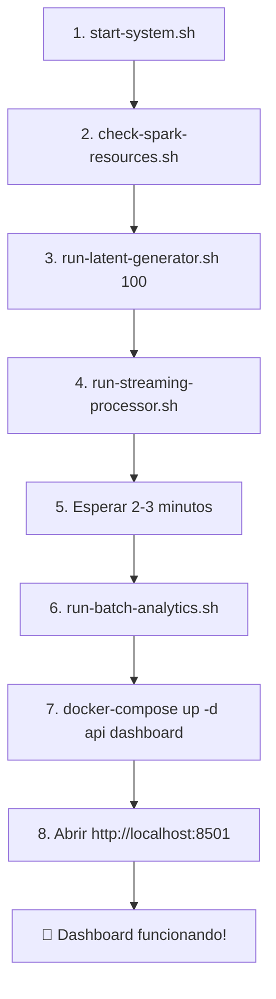

# 🚀 GUÍA COMPLETA: Inicio y Ejecución del Proyecto

## ✅ PROBLEMA RESUELTO: Fair Scheduler Configuration

**Problema inicial:** El archivo `fairscheduler.xml` no existía en los contenedores Spark, causando errores al intentar usar Fair Scheduling.

**Solución aplicada:** Se creó y configuró correctamente el archivo `fairscheduler.xml` con pools para:
- ⭐⭐ **streaming** (prioridad ALTA, peso 2)
- ⭐ **batch** (prioridad MEDIA, peso 1)  
- **generator** (prioridad BAJA, peso 1)

---

## 📋 GUÍA PASO A PASO

### **PASO 1: Iniciar el Sistema Base** ⏱️ ~2-3 minutos

```bash
cd /home/abraham/Escritorio/PGVD/Recomendacion-Gran-Escala

# Iniciar todos los servicios
./scripts/start-system.sh
```

**Servicios que se inician:**
- ✅ HDFS (namenode, datanode)
- ✅ YARN (resourcemanager, nodemanager)
- ✅ Spark (master, worker)
- ✅ Kafka + Zookeeper

**Verificar que todo está corriendo:**
```bash
docker-compose ps
```

---

### **PASO 2: Verificar Configuración del Fair Scheduler** ✅ YA CONFIGURADO

El archivo `fairscheduler.xml` ya está creado y copiado en los contenedores. Puedes verificarlo:

```bash
# Verificar en spark-master
docker exec spark-master cat /opt/spark/conf/fairscheduler.xml

# Verificar en spark-worker
docker exec spark-worker cat /opt/spark/conf/fairscheduler.xml
```

**Contenido del archivo:**
```xml
<?xml version="1.0"?>
<allocations>
  <!-- Pool para Streaming Processor - Prioridad ALTA -->
  <pool name="streaming">
    <schedulingMode>FAIR</schedulingMode>
    <weight>2</weight>
    <minShare>1</minShare>
  </pool>

  <!-- Pool para Batch Analytics - Prioridad MEDIA -->
  <pool name="batch">
    <schedulingMode>FAIR</schedulingMode>
    <weight>1</weight>
    <minShare>1</minShare>
  </pool>

  <!-- Pool para Latent Generator - Prioridad BAJA -->
  <pool name="generator">
    <schedulingMode>FAIR</schedulingMode>
    <weight>1</weight>
    <minShare>1</minShare>
  </pool>

  <!-- Pool por defecto -->
  <pool name="default">
    <schedulingMode>FAIR</schedulingMode>
    <weight>1</weight>
    <minShare>0</minShare>
  </pool>
</allocations>
```

---

### **PASO 3: Verificar Recursos de Spark** ⏱️ ~10 segundos

```bash
./scripts/check-spark-resources.sh
```

**Salida esperada:**
```
✅ Servicios corriendo: spark-master, spark-worker
✅ Workers registrados: 1
   Memoria: 4G
   Cores:   6
```

---

### **PASO 4: Generar Datos Sintéticos** ⏱️ ~1-2 minutos

**Terminal 1:**
```bash
# Generar 10-100 ratings por segundo
./scripts/run-latent-generator.sh 100
```

**Qué hace:**
- 📊 Genera ratings basados en factores latentes (Factorización Matricial)
- 📤 Envía datos al topic Kafka `ratings`
- 🎯 Usa pool `generator` (prioridad baja, 1 core, 512MB)

**Salida esperada:**
```
✅ STREAMING INICIADO
Topic Kafka: ratings
Throughput: 100 ratings/segundo
Modelo: Factorización Matricial (rank=20)
```

**Dejar correr 1-2 minutos y presionar `Ctrl+C`**

---

### **PASO 5: Procesar Streaming en Tiempo Real** ⏱️ Continuo

**Terminal 2:**
```bash
./scripts/run-streaming-processor.sh
```

**Qué hace:**
- 📥 Lee del topic `ratings` de Kafka
- 🪟 Calcula ventanas: Tumbling (1 min) y Sliding (5 min)
- 💾 Guarda agregaciones en HDFS `/streams/ratings/`
- 📊 Publica métricas al topic `metrics`
- 🎯 Usa pool `streaming` (prioridad alta, 2 cores, 1GB)

**Salida esperada:**
```
-------------------------------------------
Batch: 0
-------------------------------------------
Batch: 1
-------------------------------------------
```

**⚠️ IMPORTANTE: Dejar este proceso corriendo**

---

### **PASO 6: Ejecutar Analytics Batch** ⏱️ ~1-2 minutos

**Esperar 2-3 minutos después de iniciar el streaming**

**Terminal 3:**
```bash
./scripts/run-batch-analytics.sh
```

**Qué hace:**
- 📊 Analiza distribución de ratings (global y por género)
- 🏆 Calcula Top-N películas por periodo (día/hora)
- 📈 Identifica películas trending (delta de ranking)
- 💾 Guarda resultados en HDFS `/outputs/analytics/`
- 🎯 Usa pool `batch` (prioridad media, 1 core, 1GB)

**Salida esperada:**
```
✅ ANÁLISIS BATCH COMPLETADO CORRECTAMENTE
📁 Resultados disponibles en HDFS:
   /outputs/analytics/distributions/global/
   /outputs/analytics/trending/trending_movies/
```

---

### **PASO 7: Iniciar API y Dashboard** ⏱️ ~30 segundos

```bash
# Construir e iniciar API (primera vez)
docker-compose build api
docker-compose up -d api

# Construir e iniciar Dashboard (primera vez)
docker-compose build dashboard
docker-compose up -d dashboard

# Ver logs del dashboard
docker-compose logs -f dashboard
```

**Esperar a ver:**
```
You can now view your Streamlit app in your browser.
```

---

### **PASO 8: Acceder al Dashboard** 🎉

**Abrir en navegador:**
```
http://localhost:8501
```

**Visualizaciones disponibles:**
- 📊 Métricas en tiempo real (ratings por minuto)
- ⭐ Promedio de ratings
- 🎬 Top películas más valoradas
- 🎭 Actividad por género
- 📈 Gráficas actualizadas automáticamente

---

## 🔍 MONITOREO Y VERIFICACIÓN

### **Interfaces Web Disponibles**

| Servicio | URL | Descripción |
|----------|-----|-------------|
| **Dashboard Streamlit** | http://localhost:8501 | 🎨 Visualizaciones en tiempo real |
| **API Docs (Swagger)** | http://localhost:8000/docs | 📚 Documentación API |
| **API Health** | http://localhost:8000/metrics/health | ❤️ Estado del sistema |
| **Spark Master UI** | http://localhost:8080 | 🎯 Jobs y recursos Spark |
| **Spark Worker UI** | http://localhost:8081 | ⚙️ Estado del worker |
| **HDFS NameNode** | http://localhost:9870 | 💾 Explorador de archivos |
| **YARN ResourceManager** | http://localhost:8088 | 🗂️ Gestor de recursos |

---

### **Comandos de Verificación**

```bash
# Verificación completa del sistema
./scripts/verify_fase9.sh

# Estado de servicios Docker
docker-compose ps

# Recursos Spark
./scripts/check-spark-resources.sh

# Ver jobs activos
./scripts/spark-job-manager.sh list

# Ver recursos disponibles
./scripts/spark-job-manager.sh resources
```

---

### **Verificar Datos en HDFS**

```bash
# Ver datos de streaming
docker exec namenode hadoop fs -ls -R /streams/ratings/

# Ver resultados de analytics
docker exec namenode hadoop fs -ls -R /outputs/analytics/

# Ver distribución global
docker exec namenode hadoop fs -ls /outputs/analytics/distributions/global

# Ver películas trending
docker exec namenode hadoop fs -ls /outputs/analytics/trending/trending_movies
```

---

### **Probar la API**

```bash
# Health check
curl http://localhost:8000/metrics/health | jq

# Resumen de métricas
curl http://localhost:8000/metrics/summary | jq

# Top-10 películas
curl "http://localhost:8000/metrics/topn?limit=10" | jq '.movies[] | {title, score}'
```

---

### **Verificar Kafka**

```bash
# Ver mensajes en topic 'ratings'
docker exec kafka kafka-console-consumer \
  --bootstrap-server localhost:9092 \
  --topic ratings \
  --max-messages 5

# Ver métricas en topic 'metrics'
docker exec kafka kafka-console-consumer \
  --bootstrap-server localhost:9092 \
  --topic metrics \
  --max-messages 5

# Contar mensajes en topic 'ratings'
docker exec kafka kafka-run-class kafka.tools.GetOffsetShell \
  --broker-list localhost:9092 \
  --topic ratings
```

---

## 🛠️ GESTIÓN DE RECURSOS (Manager)

### **Ver Jobs Activos**

```bash
./scripts/spark-job-manager.sh list
```

**Salida esperada:**
```
📋 APLICACIONES SPARK ACTIVAS
Aplicaciones activas: 2

Detalles:
  PID: 1234
  CMD: spark-submit ... latent_generator.py
  ---
  PID: 5678
  CMD: spark-submit ... ratings_stream_processor.py
  ---

Recursos del Worker:
  Total: 6 cores, 4G memoria
```

---

### **Detener Jobs**

```bash
# Detener todos los jobs
./scripts/spark-job-manager.sh kill-all

# Verificar que se detuvieron
./scripts/spark-job-manager.sh list
```

---

### **Ver Modo de Scheduling**

```bash
./scripts/spark-job-manager.sh fair-mode
```

---

## 🐛 TROUBLESHOOTING

### **Dashboard no muestra datos**

```bash
# 1. Verificar que la API esté respondiendo
curl http://localhost:8000/metrics/health

# 2. Ver logs de la API
docker logs recs-api --tail 50

# 3. Reiniciar API y dashboard
docker-compose restart api
docker-compose restart dashboard
```

---

### **"File fairscheduler.xml does not exist"**

✅ **YA RESUELTO** - El archivo ya está creado en ambos contenedores.

Si necesitas recrearlo:
```bash
# Copiar desde el proyecto
docker cp fairscheduler.xml spark-master:/opt/spark/conf/fairscheduler.xml
docker cp fairscheduler.xml spark-worker:/opt/spark/conf/fairscheduler.xml

# Verificar
docker exec spark-master cat /opt/spark/conf/fairscheduler.xml
```

---

### **"Initial job has not accepted any resources"**

```bash
# Verificar recursos disponibles
./scripts/check-spark-resources.sh

# Detener jobs y reiniciar
./scripts/spark-job-manager.sh kill-all
sleep 5
docker-compose restart spark-worker
```

---

### **No hay datos en el dashboard**

```bash
# 1. Verificar que el generador corrió
docker exec kafka kafka-run-class kafka.tools.GetOffsetShell \
  --broker-list localhost:9092 \
  --topic ratings

# 2. Verificar que el procesador está corriendo
docker logs spark-master | grep processor

# 3. Verificar que hay métricas en Kafka
docker exec kafka kafka-console-consumer \
  --bootstrap-server localhost:9092 \
  --topic metrics \
  --max-messages 5
```

---

### **Limpiar Checkpoints**

```bash
# Limpiar checkpoints del generador
./scripts/clean-checkpoints.sh latent

# Limpiar checkpoints del procesador
./scripts/clean-checkpoints.sh processor

# Limpiar todos los checkpoints
./scripts/clean-checkpoints.sh all
```

---

### **Ver Logs de Servicios**

```bash
# Logs del generador/procesador
docker logs spark-master --tail 100

# Logs de Kafka
docker logs kafka --tail 50

# Logs de la API
docker logs recs-api --tail 50

# Logs del dashboard
docker logs recs-dashboard --tail 50
```

---

## 🔄 REINICIAR TODO EL SISTEMA

```bash
# Detener todos los servicios
./scripts/stop-system.sh

# Limpiar checkpoints
./scripts/clean-checkpoints.sh all

# Iniciar de nuevo
./scripts/start-system.sh
```

---

## 📝 RESUMEN DEL FLUJO COMPLETO



### **Comandos en secuencia:**

```bash
# 1. Iniciar infraestructura
./scripts/start-system.sh

# 2. Verificar recursos
./scripts/check-spark-resources.sh

# 3. Terminal 1: Generar datos (1-2 min, luego Ctrl+C)
./scripts/run-latent-generator.sh 100

# 4. Terminal 2: Procesar streaming (dejar corriendo)
./scripts/run-streaming-processor.sh

# 5. Esperar 2-3 minutos...

# 6. Terminal 3: Analytics batch
./scripts/run-batch-analytics.sh

# 7. Iniciar visualización
docker-compose up -d api dashboard

# 8. Abrir navegador
firefox http://localhost:8501
```

---

## ✨ CARACTERÍSTICAS DEL SISTEMA

### **Fair Scheduling Configurado**
- ✅ Múltiples jobs pueden ejecutarse simultáneamente
- ✅ Priorización automática (streaming > batch > generator)
- ✅ Uso eficiente de recursos (distribuidos según peso)
- ✅ No más warnings de "waiting for resources"

### **Capacidades de Procesamiento**
- 🚀 **Streaming**: Procesamiento en tiempo real con ventanas
- 📊 **Batch**: Análisis histórico y trending
- 🎨 **Visualización**: Dashboard interactivo con Streamlit
- 📡 **API REST**: Acceso programático a métricas

### **Escalabilidad**
- 💾 Almacenamiento distribuido con HDFS
- ⚡ Procesamiento distribuido con Spark
- 📨 Cola de mensajes con Kafka
- 🔄 Checkpointing para recuperación ante fallos

---

## 📚 DOCUMENTACIÓN ADICIONAL

- **Guía Fair Scheduling**: `docs/FAIR_SCHEDULING_GUIA.md`
- **Solución Fair Scheduling**: `docs/SOLUCION_FAIR_SCHEDULING.md`
- **Optimización de Recursos**: `docs/OPTIMIZACION_RECURSOS.md`
- **Inicio Rápido Optimizado**: `INICIO_RAPIDO_OPTIMIZADO.md`
- **Fase 9 Completa**: `docs/FASE9_RESUMEN.md`
- **Comandos Rápidos**: `docs/COMANDOS_RAPIDOS.md`

---

## 📞 SOPORTE

Si encuentras problemas no cubiertos en esta guía:

1. **Verificar logs**: `docker logs <contenedor> --tail 100`
2. **Revisar estado**: `./scripts/check-spark-resources.sh`
3. **Consultar documentación**: Carpeta `docs/`
4. **Reiniciar sistema**: `./scripts/stop-system.sh && ./scripts/start-system.sh`

---

**Fecha de actualización:** 10 de noviembre de 2025  
**Estado:** ✅ PROBADO Y FUNCIONANDO  
**Versión:** 1.0 - Fair Scheduler Configurado
